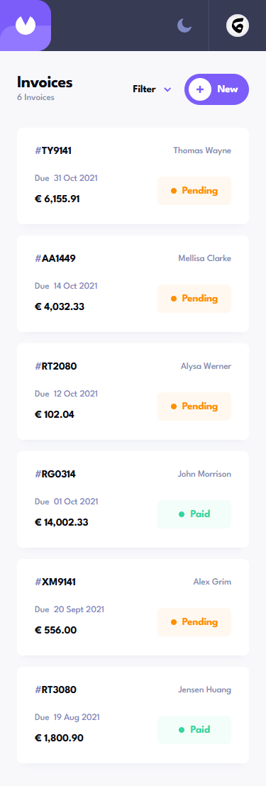
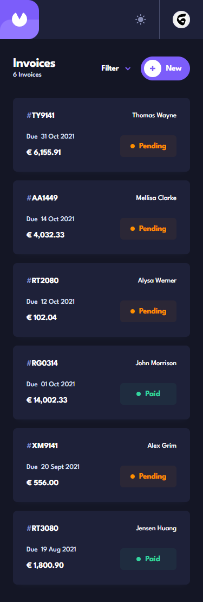
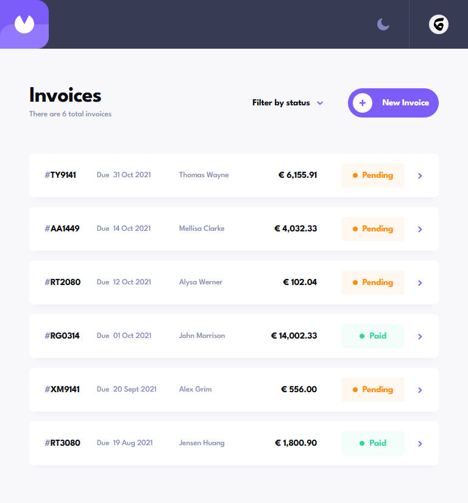
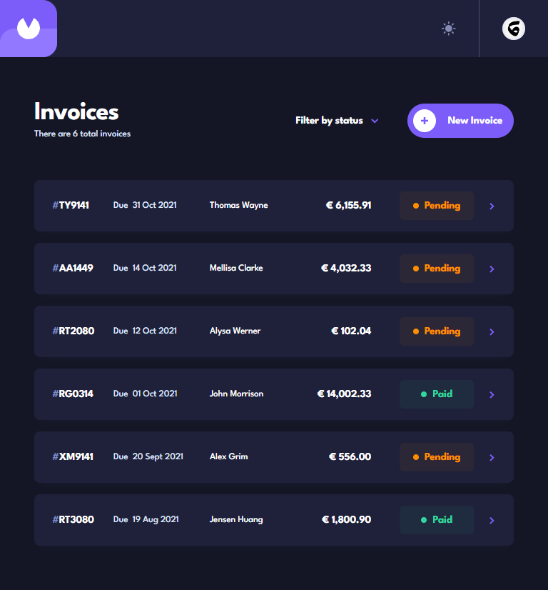
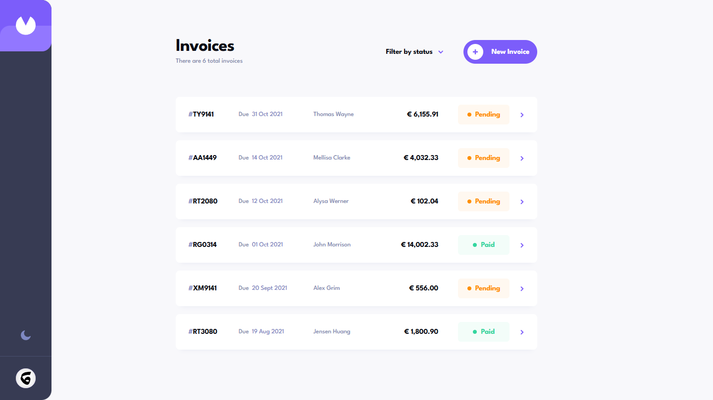
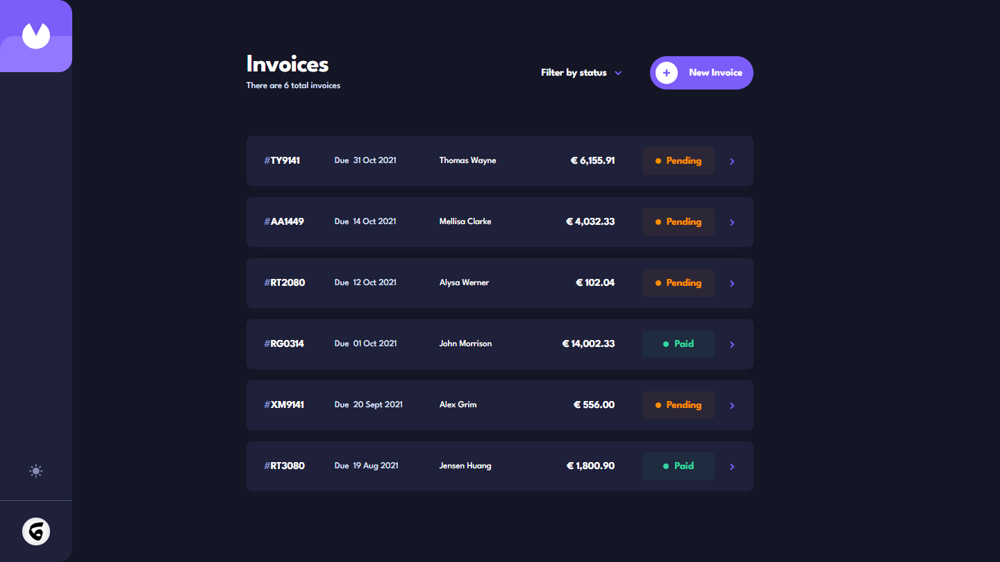

# Frontend Mentor - Invoice app solution

This is a solution to the [Invoice app challenge on Frontend Mentor](https://www.frontendmentor.io/challenges/invoice-app-i7KaLTQjl).

## Table of contents

- [Overview](#overview)
  - [The challenge](#the-challenge)
  - [Screenshot](#screenshot)
  - [Links](#links)
- [My process](#my-process)
  - [Built with](#built-with)
  - [Continued development](#continued-development)
- [Author](#author)

## Overview

### The challenge

Users should be able to:

- View the optimal layout for the app depending on their device's screen size
- See hover states for all interactive elements on the page
- Create, read, update, and delete invoices
- Receive form validations when trying to create/edit an invoice
- Save draft invoices, and mark pending invoices as paid
- Filter invoices by status (draft/pending/paid)
- Toggle light and dark mode
- Keep track of any changes, even after refreshing the browser (`localStorage`)

### Screenshot

### Links

- Live Site URL: [https://invoy.netlify.app/](https://invoy.netlify.app/)
- Solution URL: [https://github.com/nkshey/invoy](https://github.com/nkshey/invoy)

## My process

### Built with

- Semantic HTML5 markup
- CSS custom properties
- Flexbox
- CSS Grid
- Mobile-first workflow
- [React](https://reactjs.org/) - JS library
- [Vite](https://vite.dev/) - Build tool
- [React Router](https://reactrouter.com/en/main) - For routing
- [Zustand](https://zustand-demo.pmnd.rs/) - For state management
- [React Hook Form](https://www.react-hook-form.com/) - For form validation
- [Tailwind CSS](https://tailwindcss.com/) - For styles
- [Day.js](https://day.js.org/) - For creating the custom calendar

### Continued development

I plan on adding a backend to this project, so the users can login and save their invoices in a database, rather than storing them locally (localStorage).

## Author

- LinkedIn - [Nikoloz Peikrishivli](https://www.linkedin.com/in/nikapeikrishvili/)
- Frontend Mentor - [@nkshey](https://www.frontendmentor.io/profile/nkshey)
